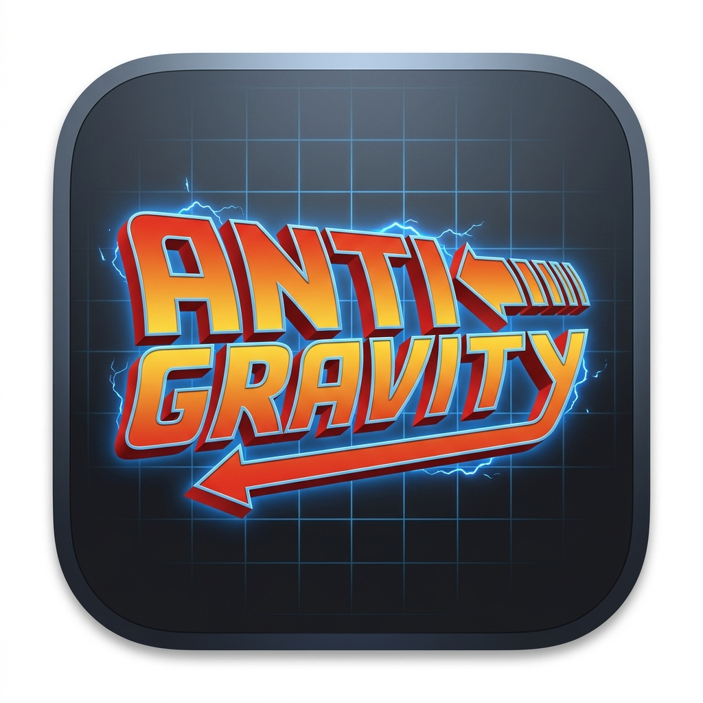
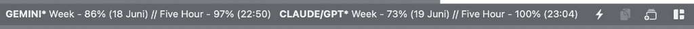
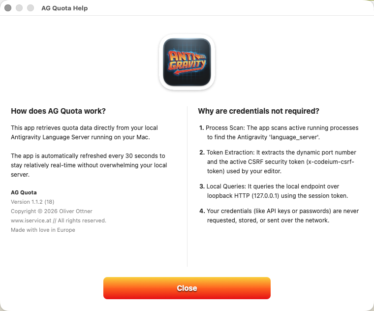

# AG Quota Monitor 🚀

A native, lightweight macOS menu bar application designed to monitor your local **Google Antigravity** token quotas (Gemini and Claude/GPT) in real-time.

  

---

## Features

- **Real-Time Monitoring**: Queries your local Antigravity Language Server every 30 seconds to fetch up-to-date rolling weekly and 5-hour token quotas.
- **Attributed Bold Displays**: Custom-drawn menu bar graphics highlighting model names.
- **Highly Configurable**: Toggles for Gemini, Claude/GPT, refresh timestamps, and timeframe labels.
- **Autostart Support**: Toggle automatic launch on system login directly from the app menu.
- **Zero Credentials Required**: Discovers local server ports and CSRF session tokens securely via local process scans (`ps` and `lsof`) entirely offline. No passwords or API keys are ever requested or stored.

---

## Interface Preview

### Menu Bar Display Modes

You can toggle between a compact percentages-only layout and a full layout showing timeframes and reset dates/timestamps.

#### Compact Mode (Timeframe & Show Refresh disabled)

  

#### Full Info Mode (Timeframe & Show Refresh enabled)

  

### Help & Configuration Dialog

  

---

## Configurable Options in the Dropdown Menu:

- **Gemini**: Toggle showing/hiding Gemini quota statistics.
- **Claude/GPT**: Toggle showing/hiding Claude/GPT quota statistics.
- **Show Refresh**: Toggle the reset timestamp suffix (e.g. `(18 Juni)` or `(17:50)`) inside the menu bar.
- **Timeframe**: Toggle showing/hiding explicit time frame prefixes (`Week - ` and `Five Hour - `) to save menu bar space.
- **Autostart with System**: Toggle registering the app with macOS `SMAppService` to autostart at login.
- **How?**: Opens the custom-designed, styled two-column dialog explaining the internal mechanisms.

---

## Installation & Distribution

1. Download the latest release package: **[AGQuota.app.zip](https://github.com/oliverottner/AG_Quota/releases/latest)**.
2. Uncompress the archive and drag the `AGQuota.app` application into your `/Applications` directory.
3. Launch `AGQuota.app` and monitor your usage limits quietly in your macOS status bar.

---

## License & Credits

- Developed by **Oliver Ottner** ([www.iservice.at](https://www.iservice.at)).
- Made with ❤️ in Europe.
